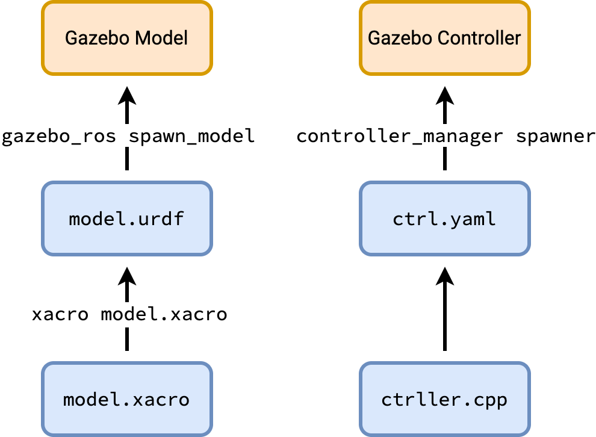

# GazeboSetupTutorial

Following this tutorial requires the installation of the `rrbot_description` packages which can be obtained using

```zsh
git clone https://bitbucket.org/theconstructcore/rrbot_pkgs.git
```

## Structure of Gazebo simulations

The structure of most Gazebo simulations are as follows:



## Launchfile

This part of the tutorial goes into how Gazebo is launched, how the URDF file if created and spawned into Gazebo, and how to connect the controller.

### How to launch Gazebo

This launches Gazebo with an empty scene:

```xml
<arg name="headless" default="false" doc="Should the gazebo GUI be launched?" />
<arg name="world" default="worlds/empty.world" doc="Filename to a SDF World for gazebo to use" />

<!-- Launches Gazebo with empty environment -->
<include file="$(find gazebo_ros)/launch/empty_world.launch">
    <arg name="world_name" value="$(arg world)"/>
    <arg name="gui" value="$(eval not arg('headless'))"/>
    <!-- Always start in paused mode, and only unpause when spawning the model -->
    <arg name="paused" value="true"/>
    <arg name="use_sim_time" value="true"/>
</include>
```

### How to spawn model in Gazebo

The first line is the command that creates the urdf file using `xacro`. The second line brings the created URDF file into Gazebo. The `-urdf` tag denotes that the generated model is in the format of an URDF file, the `-model` tag represents the name of the spawned model.

```xml
<!-- Spawns robot URDF model to Gazebo -->
<param name="robot_description" command="xacro $(find rrbot_description)/urdf/rrbot.xacro"/>
<node name="rrbot_model_spawner" pkg="gazebo_ros" type="spawn_model" args="-param robot_description -urdf -model rrbot -unpause"/>
```

Here we provide a detailed description of all of the tags:

```console
>>> rosrun gazebo_ros spawn_model -h    
usage: spawn_model [-h] (-urdf | -sdf) (-file FILE_NAME | -param PARAM_NAME | -database MODEL_NAME | -stdin) -model MODEL_NAME [-reference_frame REFERENCE_FRAME] [-gazebo_namespace GAZEBO_NAMESPACE] [-robot_namespace ROBOT_NAMESPACE] [-unpause] [-wait MODEL_NAME] [-x X] [-y Y] [-z Z]
                   [-R R] [-P P] [-Y Y] [-J JOINT_NAME JOINT_POSITION] [-package_to_model] [-b]

Spawn a model in gazebo using the ROS API

optional arguments:
  -h, --help            show this help message and exit
  -urdf                 Incoming xml is in urdf format
  -sdf                  Incoming xml is in sdf format
  -file FILE_NAME       Load model xml from file
  -param PARAM_NAME     Load model xml from ROS parameter
  -database MODEL_NAME  Load model XML from specified model in Gazebo Model Database
  -stdin                Load model from stdin
  -model MODEL_NAME     Name of model to spawn
  -reference_frame REFERENCE_FRAME
                        Name of the model/body where initial pose is defined. If left empty or specified as "world", gazebo world frame is used
  -gazebo_namespace GAZEBO_NAMESPACE
                        ROS namespace of gazebo offered ROS interfaces. Defaults to /gazebo/
  -robot_namespace ROBOT_NAMESPACE
                        change ROS namespace of gazebo-plugins
  -unpause              !!!Experimental!!! unpause physics after spawning model
  -wait MODEL_NAME      !!!Experimental!!! wait for model to exist
  -x X                  x component of initial position, meters
  -y Y                  y component of initial position, meters
  -z Z                  z component of initial position, meters
  -R R                  roll angle of initial orientation, radians
  -P P                  pitch angle of initial orientation, radians
  -Y Y                  yaw angle of initial orientation, radians
  -J JOINT_NAME JOINT_POSITION
                        initialize the specified joint at the specified position
  -package_to_model     convert urdf <mesh filename="package://..." to <mesh filename="model://..."
  -b                    bond to gazebo and delete the model when this program is interrupted
```

### How to connect the controller

The first line defines the configurations of the controller using existing controller classes. The second line spawns the controller such that it can be used to control the model in Gazebo. The last node publishes the robot state.

```xml
<!-- Start controller -->
<rosparam file="$(find setup_tutorial)/config/control.yaml" command="load"/>
<node name="controller_spawner" pkg="controller_manager" type="spawner" respawn="false" output="screen" ns="/rrbot" args="joint1_position_controller joint2_position_controller joint_state_controller"/>
<node name="robot_state_publisher" pkg="robot_state_publisher" type="robot_state_publisher" respawn="false" output="screen">
    <remap from="/joint_states" to="/rrbot/joint_states" />
</node>
```

A detailed guide of what the `args` mean for the control spawner is provided here:

```console
>>> rosrun controller_manager spawner -h
usage: spawner [-h] [--stopped] [--wait-for topic] [--namespace ns] [--timeout T] [--no-timeout] [--shutdown-timeout SHUTDOWN_TIMEOUT] controller [controller ...]

Controller spawner

positional arguments:
  controller            controllers to load

optional arguments:
  -h, --help            show this help message and exit
  --stopped             loads controllers, but does not start them
  --wait-for topic      does not load or start controllers until it hears "True" on a topic (Bool)
  --namespace ns        namespace of the controller_manager services
  --timeout T           how long to wait for controller_manager services when starting up [s] (default: 30). <=0 waits indefinitely.
  --no-timeout          wait for controller_manager services indefinitely (same as `--timeout 0`)
  --shutdown-timeout SHUTDOWN_TIMEOUT
                        DEPRECATED: this argument has no effect.
```

In the above example the `args`: `joint1_position_controller joint2_position_controller joint_state_controller` represents the loaded controllers.

## Create custom controller

To command to create a package for a custom controller with the basic dependecies required is

```console
catkin_create_pkg my_controller roscpp pluginlib controller_interface hardware_interface
```

Then a `controller_plugins.xml` needs to be created and filled. The next step is to go to the `package.xml` file of your package. Inside the `<export>` tag, place the following line:

```xml
<controller_interface plugin="${prefix}/controller_plugins.xml"/>
```

Finally, we need to updated the `CMakeLists.txt` file to include

```cmake
add_compile_options(-std=c++11)
add_library(controller_tutorial_lib src/controller.cpp)
target_link_libraries(controller_tutorial_lib ${catkin_LIBRARIES})
```
